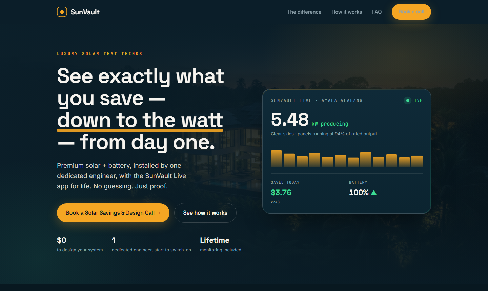
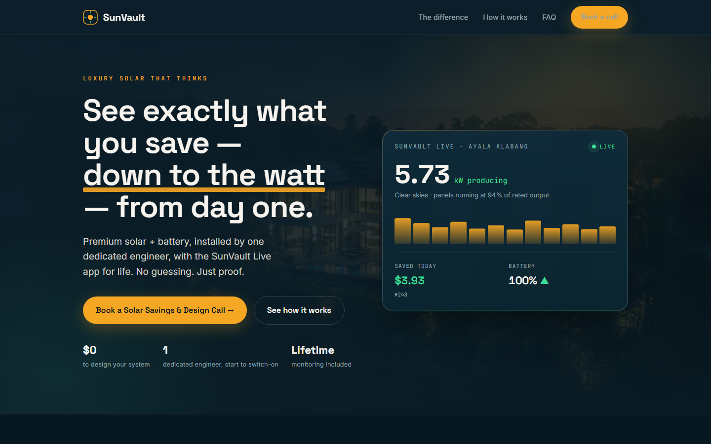
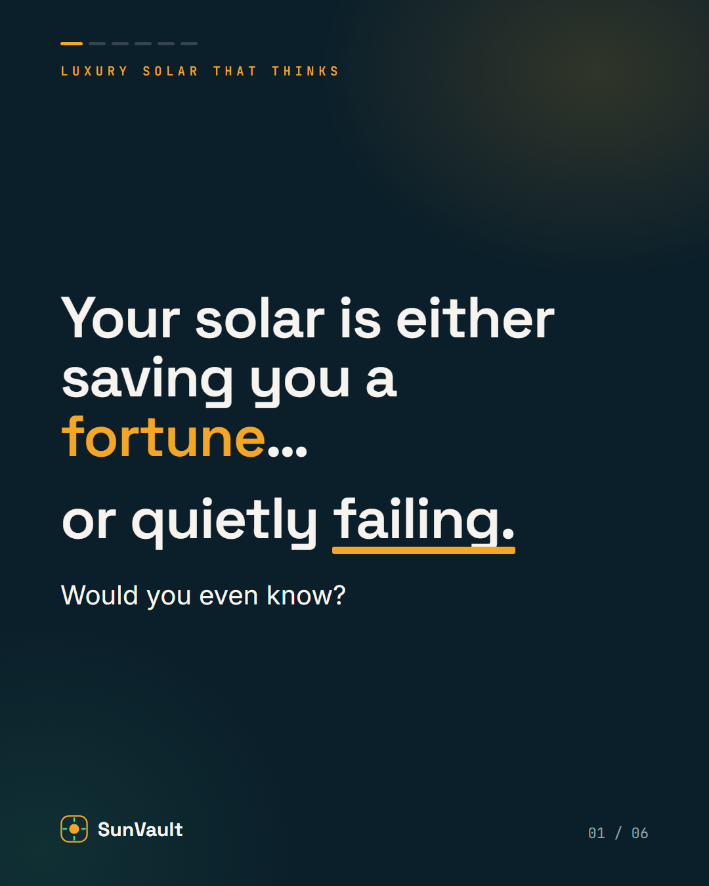
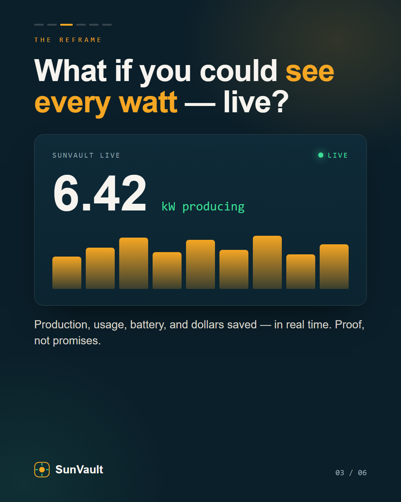
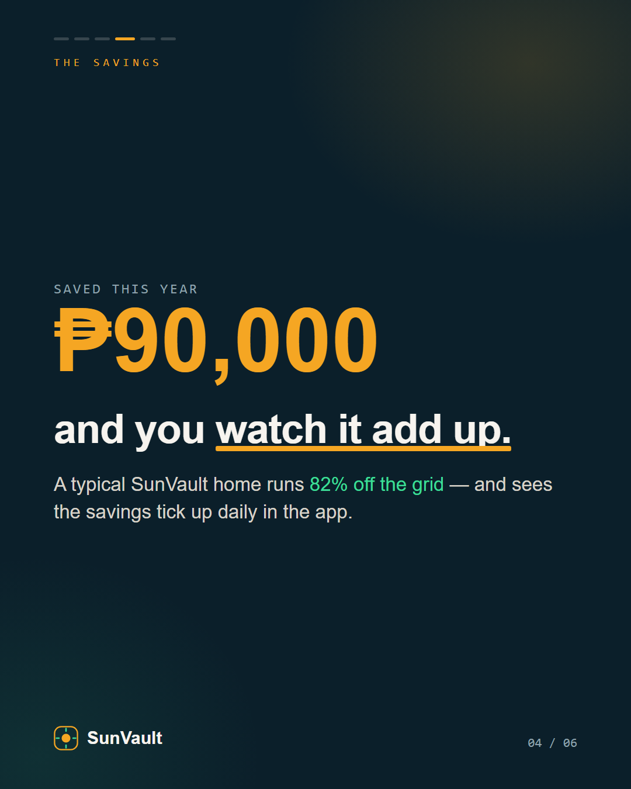
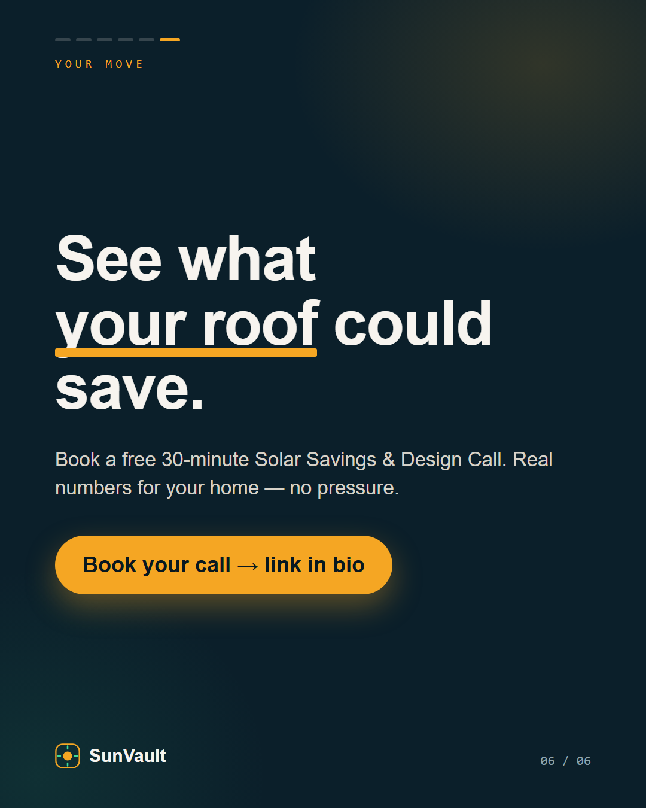

# SunVault — Smart Solar Lead-Gen System

> **Capstone build.** A complete, client-ready lead-generation system for **SunVault**, a
> luxury solar installer whose edge is **lifetime IoT monitoring** — homeowners see every watt
> they produce and every dollar they save, live, from day one.
>
> *"See exactly what you save — down to the watt — from day one."*

This README is the **master walkthrough** and the case study you present. Each part explains
what was built, links its runbook, and shows a screenshot. Drop your screenshots into `D5/`
using the filenames below and this page renders as a full, real-looking build.

---

## The system at a glance

A stranger moves left → right through the funnel:

| The lead sees | Tool | In this repo |
|---|---|---|
| Instagram carousel + Facebook ad *(draft)* | Meta | `carousel/`, `ad/` |
| A premium landing page | Claude-built HTML, deployed | `landing-page/` |
| A booking → a live pipeline | GoHighLevel | `pipeline/` |
| Branded emails + automations under the hood | GoHighLevel | `emails/`, `automations/` |

**Brand:** midnight navy `#0B1F2A` · solar amber `#F5A623` · live green `#3DDC97` ·
Space Grotesk + Inter. Full definition in [`brief.md`](brief.md). System plan in [`plan.md`](plan.md).

---

## How to build it (order)

Follow the runbooks in order; screenshot each ✅ step into `D5/`. Everything you paste/import
is already generated in this repo.

1. [`runbooks/01-pipeline-ghl.md`](runbooks/01-pipeline-ghl.md) — pipeline + calendar
2. [`runbooks/02-landing-deploy.md`](runbooks/02-landing-deploy.md) — deploy the page
3. [`runbooks/03-carousel-fb-ad.md`](runbooks/03-carousel-fb-ad.md) — carousel + ad draft
4. [`runbooks/04-emails-ghl.md`](runbooks/04-emails-ghl.md) — pretty emails
5. [`runbooks/05-automations-ghl.md`](runbooks/05-automations-ghl.md) — automations

---

## Part 1 — The Pipeline

A GoHighLevel pipeline (**New Lead → Consult Booked → Site Assessment → Proposal Sent → Won**,
+ Lost) populated with **16 sample leads** (~$110k total), plus a **Solar Savings & Design
Call** booking calendar — the conversion point the whole system aims at.
Design: [`pipeline/pipeline-design.md`](pipeline/pipeline-design.md) · Import file:
[`pipeline/sample-leads.csv`](pipeline/sample-leads.csv)

## Part 2 — The Landing Page

A premium, hand-built page (not a template) whose hero *is* the product: a **live energy
monitor** ticking in real time. One clear action — **Book a Solar Savings & Design Call** —
wired to the GHL calendar. Open [`landing-page/index.html`](landing-page/index.html).

## Part 3 — Carousel & Facebook Ad

A 6-slide Instagram carousel (hook → blind spot → the live difference → savings → why us → CTA)
as one branded set, and a Facebook ad **saved as a draft** (no spend, no card) pointing to the
landing page. Copy: [`carousel/carousel-copy.md`](carousel/carousel-copy.md) ·
[`ad/facebook-ad.md`](ad/facebook-ad.md)

  
  
  
  

## Part 4 — Pretty Emails

Two email-safe HTML emails (booking confirmation + pre-call nurture) — table layout, inline
CSS, 600px, first-name merge field — that render styled and on-brand in the inbox.
[`emails/01-booking-confirmation.html`](emails/01-booking-confirmation.html) ·
[`emails/02-precall-nurture.html`](emails/02-precall-nurture.html)

## Part 5 — Automations

Three automations designed for SunVault, wired to real triggers:
**A1** booking → pipeline + confirmation email · **A2** pre-call nurture · **A3** aging
follow-up on stalled proposals. Designs:
[`automations/automation-designs.md`](automations/automation-designs.md)

---

## The Bar — done checklist

- [ ] Instagram carousel + Facebook ad **draft** pointing to the landing page
- [ ] Premium landing page with a book-a-call button, on-brand
- [ ] GHL pipeline with 10–20 leads across stages + booking calendar
- [ ] 2–3 automations you designed, wired to send your emails
- [ ] 1–2 pretty HTML emails that render styled and on-brand
- [ ] Polished **Loom** client presentation naming the business
- [ ] **Raven** Day-5 build update

See [`CHEATSHEET.md`](CHEATSHEET.md) for all your links, the screenshot list, and the on-camera
scripts for the Loom + Raven videos.

---
*Showcase build. All lead data is fake, the Facebook ad stays a draft, and no real domain or
payments are connected.*
